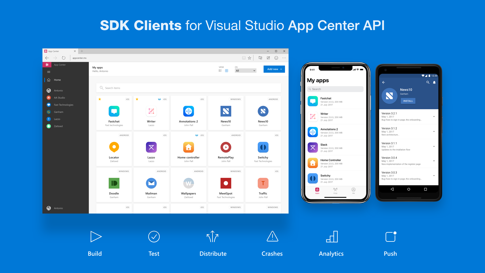

# appcenter-sdks

:tada: The missing SDKs Client for Microsoft Visual Studio App Center API - in short: SDK for App Center API

## Intro

Use VS App Center API Clients wherever you want with the **App Center SDKs**:

| Platform/Framework | Package | Install Command | Docs |
| --- | --- | --- | --- |
| python | [appcenter-sdk](https://pypi.org/project/appcenter-sdk/) | `pipenv install appcenter-sdk` | [[Python] App Center SDK API Docs](sdks/python) |
| --- | --- | --- | --- |
| --- | --- | --- | --- |
| --- | --- | --- | --- |